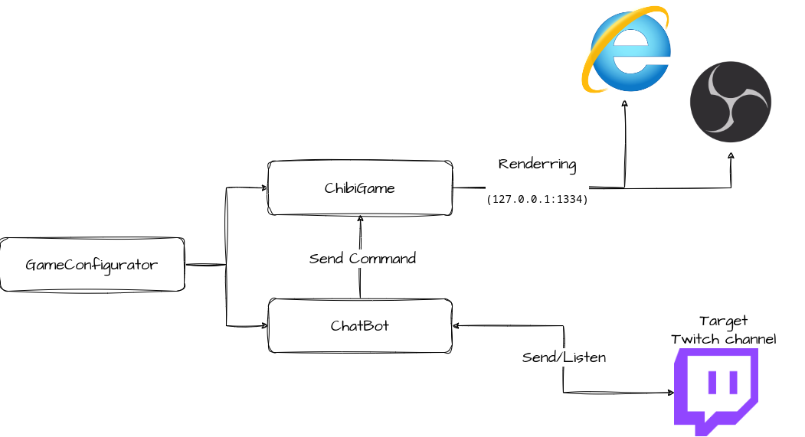
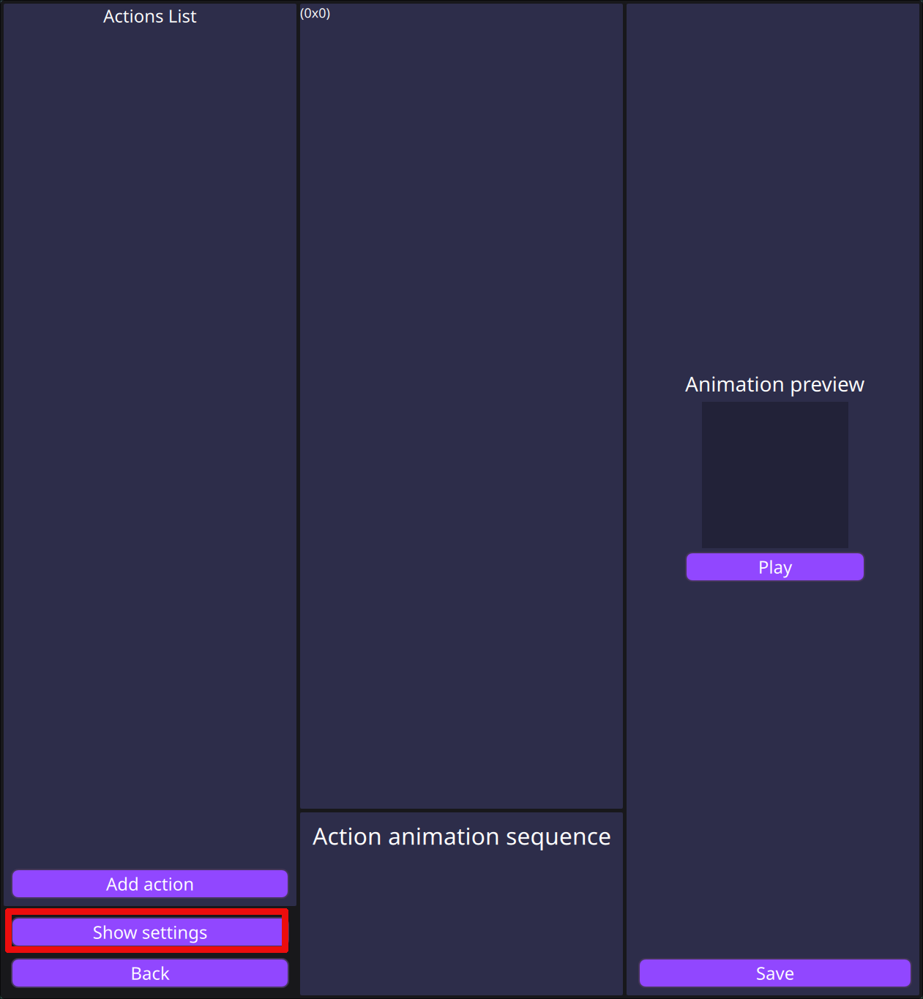
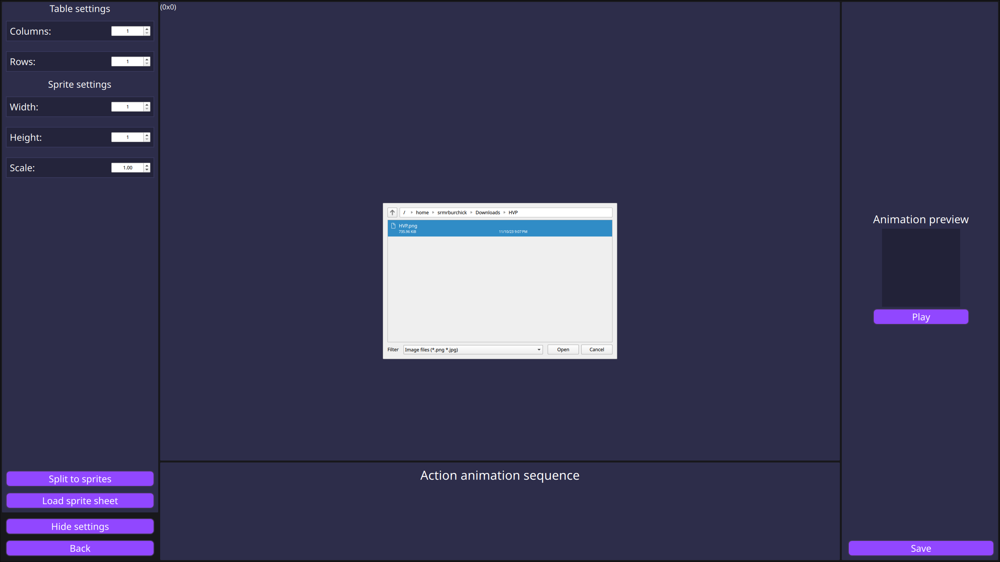
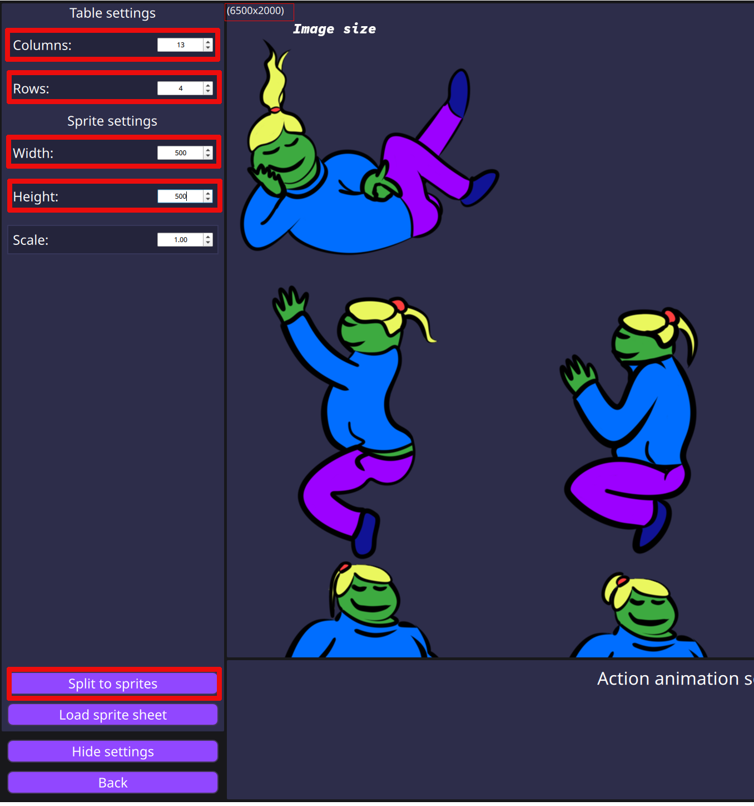
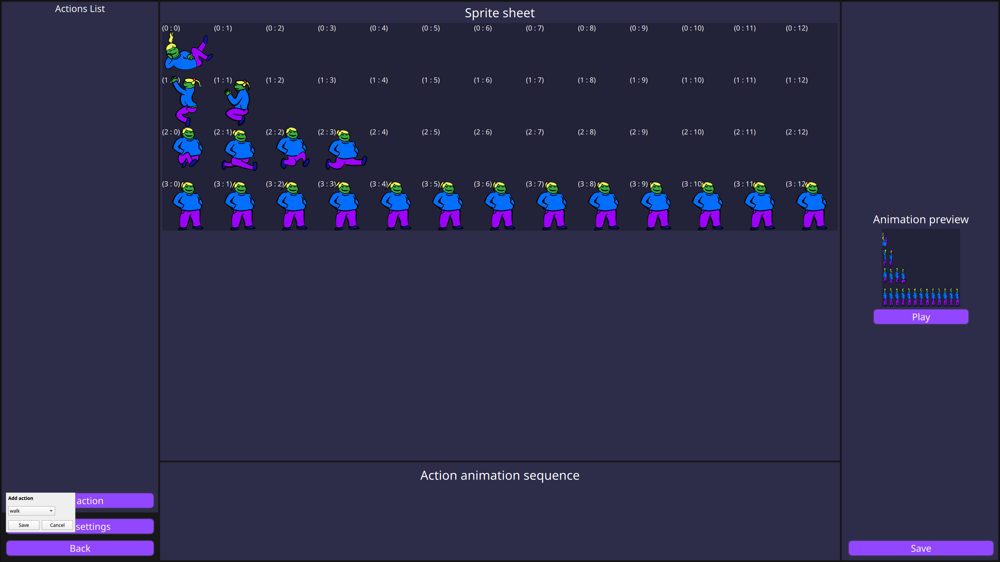
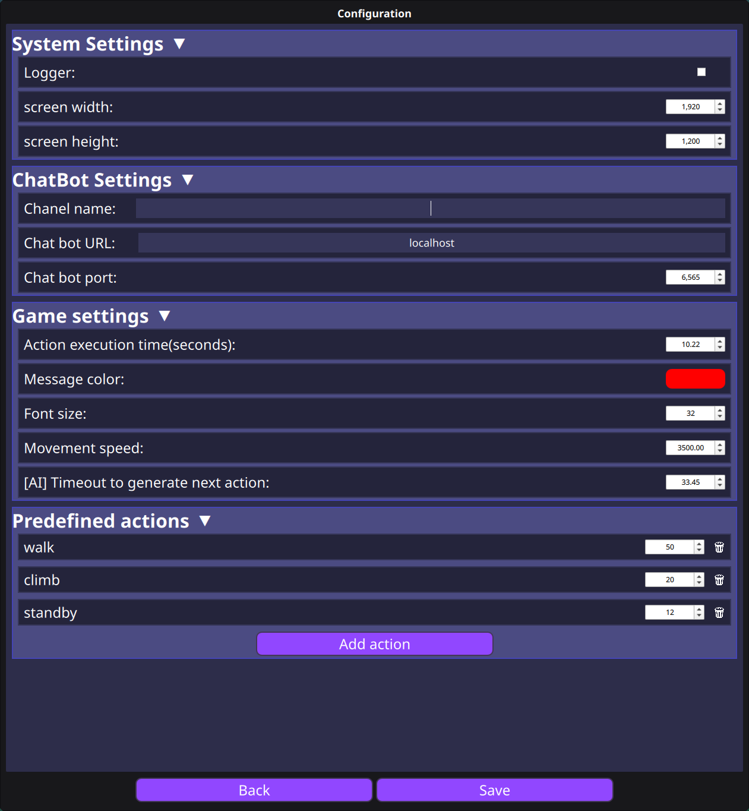
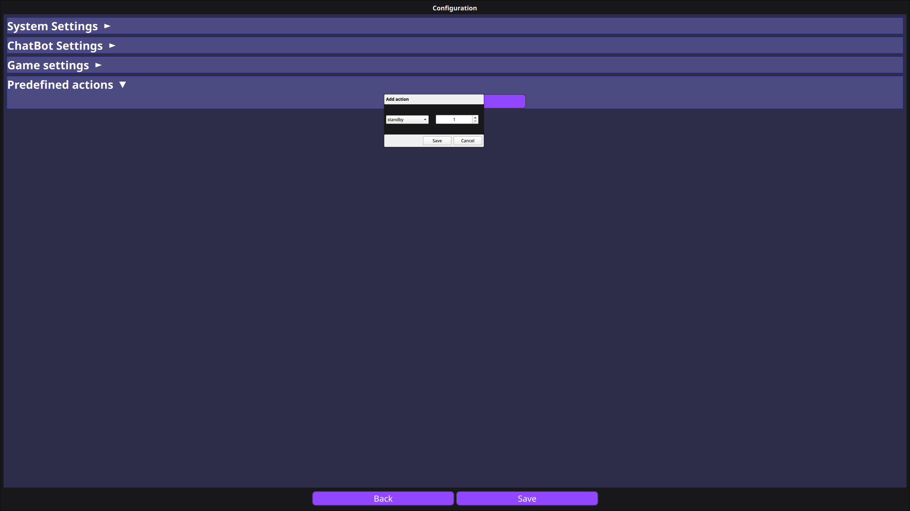

# Chibi ChatBotGame
Проста гра, схожа на чібі, яка надає можливість керувати персонажем за допомогою команд чату.
Ви можете налаштувати власні команди, які будуть представлені у вигляді унікального спрайту або їх послідовності.

## Архітектура гри

- **Game Configurator** - надає інтерфейс для керування та налаштування гри та чат-бота
- **ChibiGame** - програма wasm, яка може працювати в браузері або в браузері OBS
- **ChatBot** - бот, який підключається до наданого каналу та надсилає команди грі

## Налаштування
Завантажте [останню версію](https://github.com/SrMrBurchick/ChibiChatBotGame/releases) або клонуйте цей репозиторій, якщо ви хочете зібрати проєкт самостійно, дотримуйтесь
наданого [посібника](./SetupGuide_UA.md)

### Конфігурація зображення
Якщо ви хочете використовувати власне зображення, будь ласка, переконайтеся, що воно відповідає вимогам:
- Повний розмір зображення (ширина, висота) мають бути цілими числами
- Розмір спрайту (ширина, висота) мають бути цілими числами
- Спрайти не повинні мати проміжків між собою

Після створення зображення перейдіть на сторінку **Налаштування дій**:
1. Натисніть `Show settings`
     

2. Натисніть `Load sprite sheet` і відкрийте зображення спрайтів
     

3. Параметри налаштування:
     - *Table settings*
         - **Columns** - максимальна кількість спрайтів у рядку
         - **Rows** - максимальна кількість спрайтів у стовпці
     - *Sprite settings*: ви можете визначити розмір спрайту, розділивши ширину та висоту зображення на рядки та стовпці
         - **Width** - ширина спрайту
         - **Height** - висота спрайту
4. Натисніть `Split to sprites`.

Ось і все) Якщо ви хочете змінити розмір спрайту в грі, потрібно змінити параметр `Scale`.

### Налаштування Actions
Щоб налаштувати Actions, натисніть кнопку `Add action`. Після цього виберіть
зі списку, або створіть власну назву для action.
Важливо! Actions які є в списку, є стандартними для гри, і можуть використовуватись під час ігрової сесії.

Потім ви можете двічі клацнути спрайтом на таблиці спрайтів.
І обраний спрайт буде додано до анімаційної послідовності дії.
Ви можете змінити положення кожного спрайту в послідовності спрайтів або навіть видалити його.
Спрайти не мають обмежень щодо конкретної дії. Ви можете використовувати той самий спрайт
в різних діях або навіть в одній дії.

## Загальні налаштування

### Конфігурація гри
Щоб отримати конкретну конфігурацію гри, перейдіть на сторінку **Common Settings**.
На цій сторінці ви можете налаштувати:
- *System Settings* - ці значення надають лише розмір екрана для гри, ви можете встановити його відмінність від фактичного розміру екрана
    - **screen width**
    - **screen height**
- *Game Settings*
     - **Action execution time(секунди)** - тривалість активної дії, після тайм-ауту ця дія буде завершена
     - **Message color** - колір тексту, який з'явиться після дії `say`
     - **Font size** - розмір шрифту тексту, який з'явиться під час дії `say`
     - **Movement speed** - швидкість руху чартера
     - **Next action timeout (секунди)** - час для генерації наступної дії
- *Predefined actions* - до цього списку ви можете додати налаштовані дії на сторінці `Setup action`, з вирогідністю генерації від 1% до 100%
     

### Конфігурація чат-бота
У цій категорії ви можете налаштувати властивості чат-бота:
- **Twitch chanel** - цільовий канал для підключення
- **Chat bot URL** - адреса запущеного чат-бота
- **Chat bot Port** - порт запущеного чат-бота
