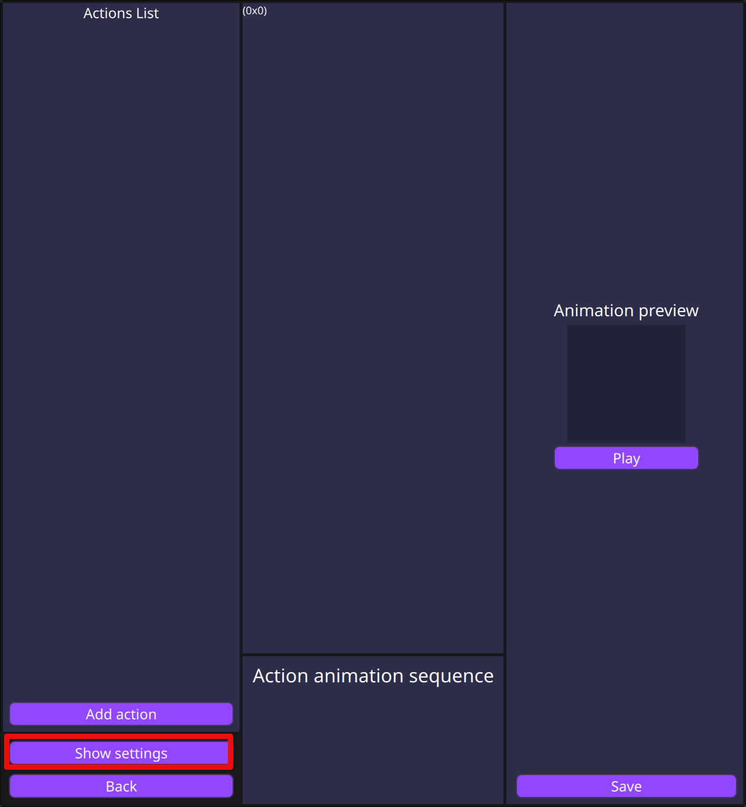
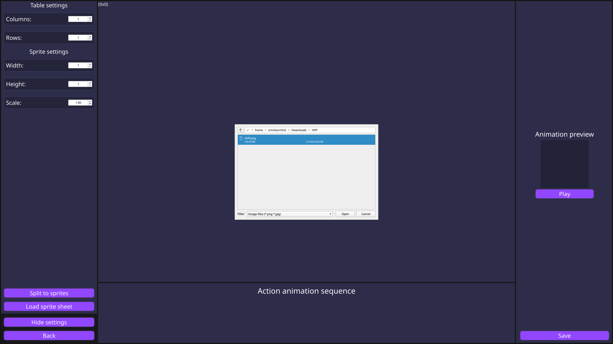
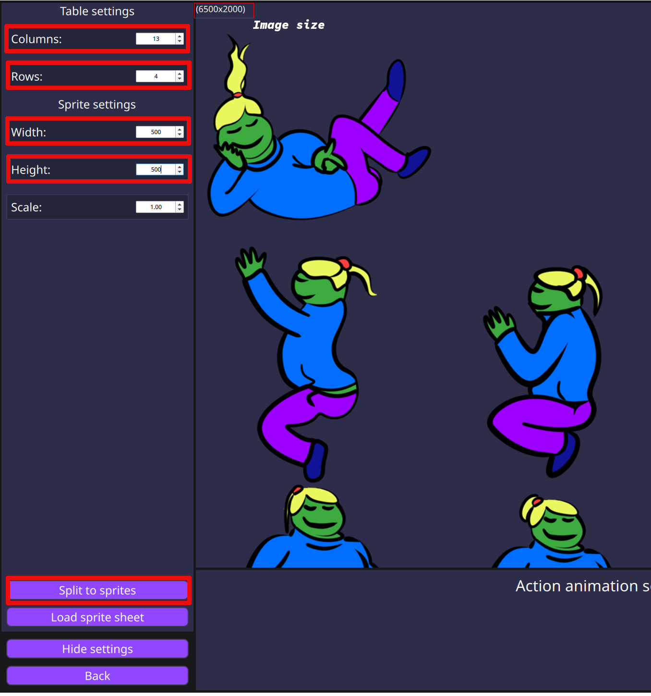
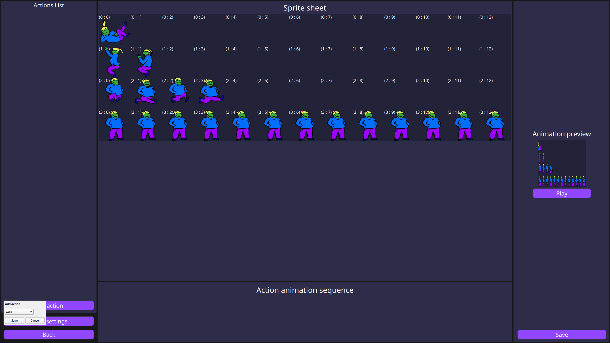
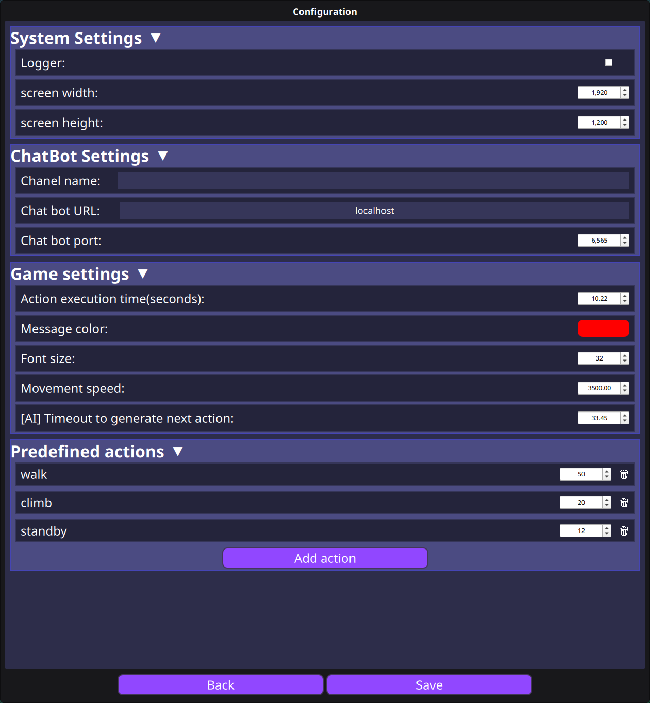

# Chibi ChatBotGame
A simple chibi like game that provides possibility to control itself by chat commands.
You can configure custom commands which be represented as unique sprite or sequence of them.

🇺🇦 [Те саме, але Українською](./Docs/Wiki/Localization/README_UA.md)

## Game Architecture

- **Game Configurator** - provides user interface to control and configure Game and Chat bot
- **ChibiGame** - wasm app that can run in browser or in the OBS browser
- **ChatBot** - bot which connects to the provided channel and sends commands to the game

## Setup
Download a latest [release](https://github.com/SrMrBurchick/ChibiChatBotGame/releases) or clone that repository. If you want to build it by you own please follow
provided [guide](./Docs/Wiki/SetupGuide.md).

### Image configuration
If you want to use your own image please make sure that your image meets the requirements:
- Full image size (width, height) should be are integer values
- Sprite size (width, height) should be are integer values
- Sprites should not have a space between each other

After creating an Image, go to the **Setup actions** page:
1. Click on `Show settings`
    

2. Click on `Load sprite sheet` and open your sprite sheet image
    

3. Setup properties:
    - Table Settings
        - Columns - max count of the sprites in row
        - Rows - max count of the sprites in column
    - Sprite Settings: you can determine sprite size by dividing Image width and height on rows and columns
        - Width - width of the sprite
        - Height - height of the sprite
4. Click on `Split to sprites`

That's it) I you want to change sprite size in game, than edit a `Scale` property.

### Actions setup
To configure actions click on the `Add Action` button. After that you can
select or add custom action name.

Then you can double click by sprite on sprite sheet.
And the selected sprite will be added to the animation sequence of the action.
You can modify position of the each sprite at the sprite sequence, or even delete it.
Sprites has no limitation to be at the specific action. You can use same sprite
in the different actions or even in the same action.

## Common settings

### Game configuration
For specific game configuration go to the **Common settings** page.
At that page you can configure:
- *System Settings* - that values only provides screen size for a game, you can set it different from your actual screen size
    - **screen width**
    - **screen height**
- *Game Settings*
    - **Action execution time(seconds)** - duration of the active action, after timeout that action will be finished
    - **Message color** - color of the text that will appear by `say` action
    - **Font size** - font size of the text  that will appear by `say` action
    - **Movement speed** - speed of the charter movement
    - **Next action timeout(seconds)** - duration to generate next action
- *Predefined actions* - at that list you can add configured actions at the `Setup action` page, with chance to execute from 1% to 100%
    

### ChatBot configuration
At that category you can configure your chat bot properties:
- **Twitch chanel** - target chanel to connect
- **Chat bot URL** - address of the running chat bot
- **Chat bot Port** - port of the running chat bot
